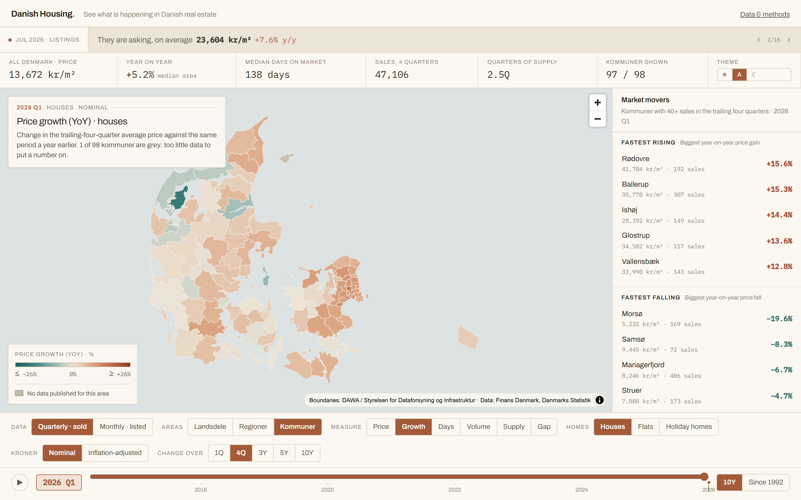
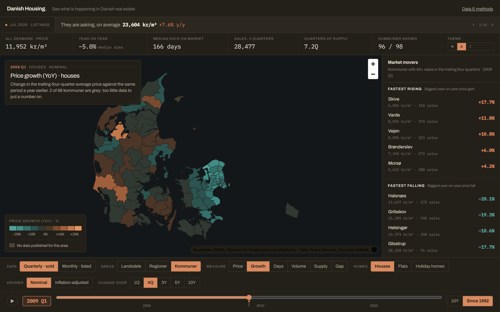
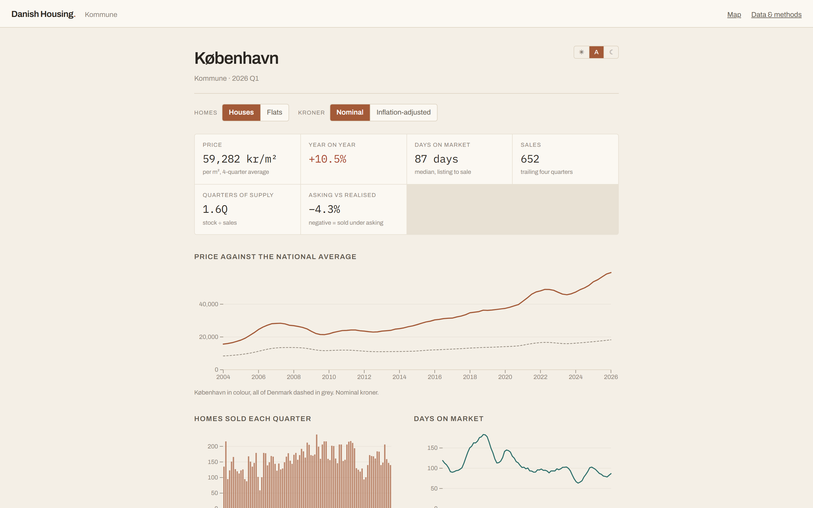

# Danish Housing

**See what is happening in Danish real estate.** Thirty-four years of Danish
house prices, selling times and supply — every kommune, every quarter, on one
map.

### → [huiyuleo.github.io/Danish-Housing](https://huiyuleo.github.io/Danish-Housing/)



---

## What the data says

A few things fall out of this data that are hard to see any other way.

**Denmark has not recovered from 2007.** Nominal prices passed the old peak
years ago. Adjust for inflation and the country as a whole is still 4% below
where it was in 2007 — nineteen years later. **81 of 97 kommuner** are below
their own real peak; Vordingborg is down 40%.

**The gap is enormous.** A square metre in Frederiksberg costs **17×** what one
in Lolland does — 88,282 kr against 5,120 kr. Zealand as a whole runs 2.9× the
median in Jutland.

**Selling time varies more than price.** A house takes 60 days to sell in
Egedal and 326 in Morsø. The national median is 138 days. Selling time also
moves *before* price does, which is why it is a headline measure here rather
than a footnote.

**Some markets run backwards.** In Frederikshavn houses are up 7.6% while flats
are down 9.9%, in the same year, in the same town.

Scrub the timeline back to 2009 and you can watch the last crash arrive from
the east — Zealand deep in blue while west Jutland was still rising:



## What you can do with it

- Switch between **11 landsdele, 5 regioner and 98 kommuner** — all published
  levels, none aggregated by hand.
- Click any area in the rankings and the map flies to it.
- Six measures: price, growth, days on market, transaction volume, quarters of
  supply, and the gap between asking and realised prices.
- **Play the timeline** from 1992 to today.
- **Adjust for inflation.** Prices are up 232% since 1995 in nominal kroner and
  84% in real ones. That toggle changes most conclusions.
- **Switch clocks.** Sale prices are quarterly — the only frequency they exist
  at. Listings are monthly and run four months ahead.
- Open any of **114 area pages** for full history and charts.
- Grey means *we don't know*. Areas with too few sales are drawn neutral and
  never show a number — [see why](docs/data-notes.md).



## Data

Everything comes from two free public sources. No scraping, no API key, no
estimated or modelled prices.

| Source | Tables | What it gives |
|---|---|---|
| [Finans Danmark](https://www.finansdanmark.dk/) Boligmarkedsstatistik | `BM010`/`BM011`, `BM020`/`BM021`, `BM030`/`BM031` | Quarterly prices, volumes, time on market — from 1992Q1 |
| Finans Danmark supply statistics | `UDB010`, `UDB020`, `UDB030` | Monthly listings — from 2004M01 |
| [Danmarks Statistik](https://www.dst.dk/) | `PRIS113` | Consumer price index, for the inflation adjustment |
| [DAWA](https://dawadocs.dataforsyningen.dk/) | — | Administrative boundaries |

This data has traps in it. A zero in the time-on-market table means *no sale
that quarter*, not *sold in zero days* — 28% of the values are zeros, and
taking them at face value paints every quiet rural area as the hottest market
in Denmark. Prices start in 1992 but transaction counts start in 2004. Postal
codes do not nest inside municipalities. All of it is written up in
**[docs/data-notes.md](docs/data-notes.md)**; the reader-facing version is on
the site's [Data & methods](https://huiyuleo.github.io/Danish-Housing/methods/)
page.

## Run it

Node 20+, and Python 3.10+ if you want to refresh the data.

```bash
git clone https://github.com/HUIYULEO/Danish-Housing.git
cd Danish-Housing
npm install
npm run dev
```

The committed data is enough to run the site. To pull fresh numbers when
Finans Danmark publishes a new quarter:

```bash
pip install requests pandas pyarrow
npm run etl        # ~3 min, rebuilds every panel
npm run simplify   # boundaries -> public/geo
```

Then commit what changed under `public/`. Run the ETL on your own machine —
sandboxed shells generally cannot reach `api.statbank.dk`.

## How it works

Next.js · TypeScript · MapLibre GL · Observable Plot · DuckDB WASM

There is no backend and no database. The dataset is a few megabytes of Parquet
served as static files, and DuckDB WASM queries it in the browser over HTTP
range requests. The map paints from an 84 KB snapshot before the query engine
has finished loading, so the first screen does not wait on it.

Deploys as a static export to any static host. GitHub Pages is wired up in
[`.github/workflows/pages.yml`](.github/workflows/pages.yml) — push to `main`
and it ships. See **[docs/deploying.md](docs/deploying.md)** for base paths,
transfer sizes and why Cloudflare Pages might suit it better.

| script | |
|---|---|
| `npm run dev` | Dev server |
| `npm run build` | Production build |
| `npm run build:static` | Static export to `out/` |
| `npm run etl` | Rebuild all data from the APIs |
| `npm run simplify` | Simplify boundaries for the web |
| `npm run typecheck` | `tsc --noEmit` |

## Attribution

Housing market data: **Finans Danmark**, Boligmarkedsstatistikken, via Danmarks
Statistik. Boundaries: **Styrelsen for Dataforsyning og Infrastruktur** (DAWA).
Danish place names are kept in Danish.

This is a data visualisation project — not a valuation, a forecast, or advice
about buying or selling a home.

## License

[MIT](LICENSE) for the code. The underlying data carries its own terms from
Finans Danmark and Danmarks Statistik.
